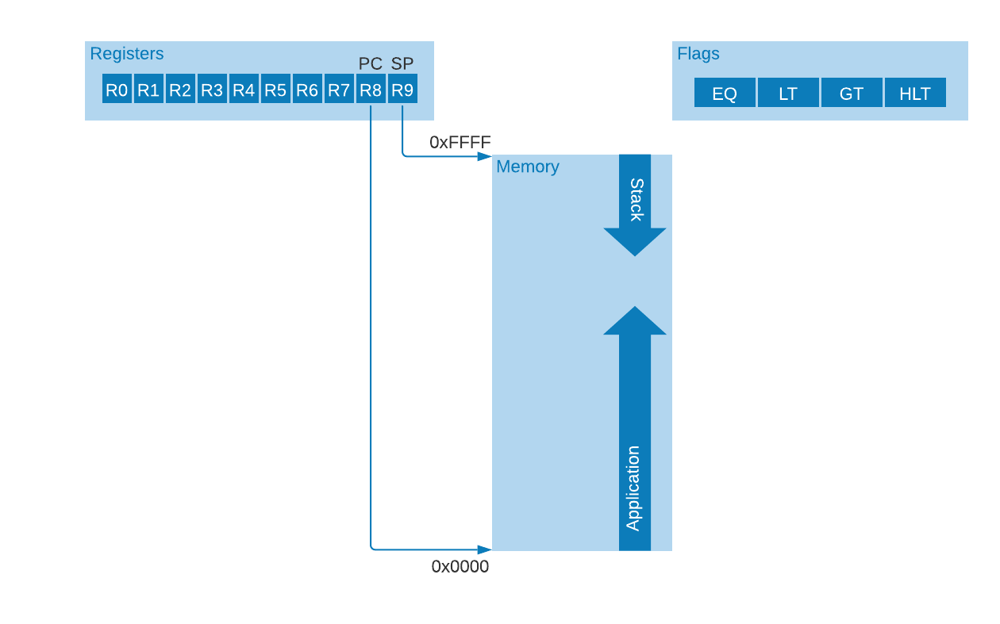
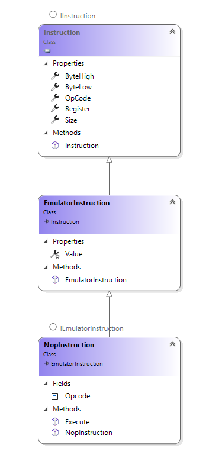
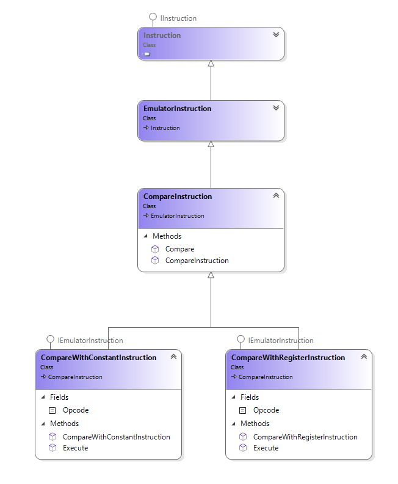
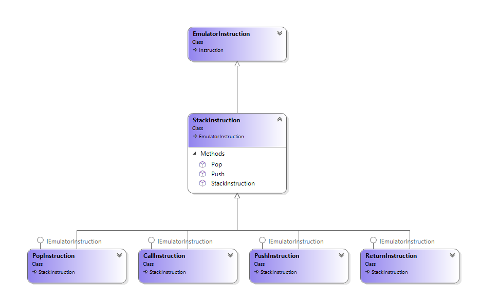

# Emulator

The emulator emulates our CPU's Instruction Set Architecture (ISA) in a literal manner. There are classes that represent the Registers, Flags 
and the RAM (memory). Each ISA instruction is represented by a distinct class that models the instruction's behavior and any side effects it has on memory, Registers or flags.




When the emulator bootstraps the main program gets a CPU object from the Dependency Injection (DI) container. This creates a CPU object and wires up it's dependencies, these are a set of registers, a block of Memory and a set of flags.

All flags are initialized to false. registers R0..R7 are initialized to zero. The Program Counter (`PC`) is also initialized to zero which is the address of the first instruction to execute.

Finally we load the RAM with the application image to execute and call the run method of the CPU. The CPU will execute fetch and execute instructions until the Halt flag is set to true, at that point execution terminates and the emulator exits to the command line.

```C#
    // Get the CPU
    ICpu cpu = serviceProvider.GetService<ICpu>();

    // Load the app image at address zero
    cpu.Memory.Load(binaryToExecute);
                
    // Run the CPU
    cpu.Run();
```

The emulator's main loop in the Run() method:

+ loops until the Halt flag in the Flags register is set to true:
  + Fetches the current instruction from the address held in the `PC` (this is always 4 bytes in size in our ISA)
  + Increments the `PC` by 4 to point to the next instruction
  + Executes the current instruction

The run method from the CPU class minus error checking is:

```C#
    do
    {
        // get the 4 bytes from the next instruction
        var bytes = Memory.Instruction(Registers.ProgramCounter);

        // get an object that emulates the effects of the instruction
        var instruction =
            instructionFactory.Create(bytes.opcode, bytes.register, bytes.byteHigh, bytes.byteLow);
                
        // increment the program counter
        Registers.ProgramCounter = (ushort)(Registers.ProgramCounter + instruction.Size);

        instruction.Execute(this);
    } while (!Flags.Halted);
```


The most important thing to note is we pre-increment the `PC` 
before executing the current instruction. If the current 
instruction modifies `PC` (for example `BRA address`) then the instruction 
can set the `PC` to the address to branch to,  subsequent execution 
takes place from there. 

For instructions that do not alter the program counter the next 
instruction in memory will be the next one to be fetched and 
executed. So in the absence of instructions that alter `PC`, instructions execute in sequential manner.

## Instructions

In the preceding source code fragment, the emulator gets the next instruction to execute from the instruction factory, passing the 4 bytes that describe the instruction. 

The instruction is then evaluated via the `Execute()` method, `Execute()` is passed the CPU object so it can effect the state of it.

All instructions in the emulator derive from the `EmulatorInstruction` class, which in turn derives from the `Instruction` class. The `Instruction` class is a shared class used in both the assembler and the emulator.



An instruction in this inheritance hierarchy has access to the 4 bytes of data that define it (`OpCode`, `ByteHigh`, `ByteLow` and 
`Register`, defined in the `Instruction` base class), instructions also have access to the 16 bit 
value associated with it from the `Value` property from the `EmulatorInstruction` parent class.

### No argument operations (`NOP`,`HALT`)

The NoOp instruction in the emulator is defined as an `EmulatorInstruction` that has an `Execute()` method that does nothing (especially it has no side effects on the CPU state)

```C#
    public class NopInstruction : EmulatorInstruction, IEmulatorInstruction
    {
        public const byte Opcode = OpCodes.Nop;

        public NopInstruction(byte register, byte high, byte low) : base(Opcode, register, high, low)
        {
        }

        public void Execute(ICpu cpu)
        {
            // Do nothing, effortlessly
        }
    }
```

As an example of an instruction that has side effects, here is the halt instruction, which stops the processor executing any more instructions and quits the 
emulator. Halt works by setting the `Halted` flag in the CPU's `Flags` register to true. 

```C#
    public class HaltInstruction : EmulatorInstruction, IEmulatorInstruction
    {
        public const byte Opcode = OpCodes.Halt;

        public HaltInstruction(byte register, byte high, byte low) : base(Opcode, register, high, low)
        {
        }

        public void Execute(ICpu cpu)
        {
            cpu.Flags.Halted = true;
        }
    }
```

There is no point detailing the implementation of every instruction in the ISA, there are significant  similarities between associate instructions. For example, 
if you have seen the implementation of the add register to register instruction; the Subtract, Divide and Multiply varieties will not surprise you.

### Mathematical operations (`ADD`,`SUB`,`MUL`,`DIV`)

This group of operations have two variants: one operates on two registers, the other applies the operation to a register and a 
constant value. For the `ADD` operator we have the classes: `AddRegisterToRegisterInstruction` and `AddConstantToRegisterInstruction`, these 
two operators differ only in where the instruction gets the value to apply to the source register.

I'm going to start to drop the constructors and OPCode declaration in the source from now on, they only add noise, just close your eyes and imagine 
them if you feel the need.

```C#
    public class AddConstantToRegisterInstruction : EmulatorInstruction, IEmulatorInstruction
    {
        public void Execute(ICpu cpu)
        {
            cpu.Registers[Register] += Value;
        }
    }

    public class AddRegisterToRegisterInstruction : EmulatorInstruction, IEmulatorInstruction
    {
        public void Execute(ICpu cpu)
        {
            cpu.Registers[Register] += cpu.Registers[ByteLow];
        }
    }
```

These instructions take a 16 bit value and store them in the target register. In the case of the constant operation, the value comes from the 
opcode data (via the Value property of the `EmulatorInstruction` parent class), for the add register to register variety the register number 
comes from the ByteLow property of the `Instruction` base class, the value comes from the Register at that index. These implementations mirror the definition of the [Instruction Set Architecture][1].

### Compare operations (`CMP`)

Comparisons, like mathematical operations come in two variants, one comparing a register to another register: `CompareWithRegisterInstruction` 
and the other comparing a register to a constant value: `CompareWithConstantInstruction`. Comparions are slightly different to other instructions 
as we interpose a new base class `CompareInstruction` between the implementation class and the `EmulatorInstruction`. 



We introduced `CompareInstruction` because the the code to set the Flags is independant of the source of the value (register or constant).

```C#
    public class CompareInstruction : EmulatorInstruction
    {
        public void Compare(ushort left, ushort right, IFlags flags)
        {
            flags.Equal = left == right;
            flags.GreaterThan = left > right;
            flags.LessThan = left < right;
        }
    }
```
The compare function sets the actual Flags. All flags are set in one action. THe ISA has no notion of branch if greater than or equal,
in a RISC instruction set like the original Gary Explains ISA, you would compare and then `BGE Address`, `BEQ Address`. 

The implementations of the two compare instructions as previously mentioned, differ only by the source of the second value to compare with

```C#
    public class CompareWithRegisterInstruction : CompareInstruction, IEmulatorInstruction
    {
        public void Execute(ICpu cpu)
        {
            var left = cpu.Registers[Register];
            var right = cpu.Registers[ByteLow];
            Compare(left, right, cpu.Flags);
        }
    }

    public class CompareWithConstantInstruction : CompareInstruction, IEmulatorInstruction
    {
        public void Execute(ICpu cpu)
        {
            var left = cpu.Registers[Register];
            var right = Value;
            Compare(left, right, cpu.Flags);
        }
    }
```

### Branch operations (`BRA`, `BEQ`, `BGT`, `BLT`)

Branch operations work by (optionally) setting the `PC` to the address from which execution should continue on the 
next CPU cycle. the `BRA` instruction does this regardless of any conditions, the address is sored in the `ByteHigh` 
and `ByteLow` of the instructions data and acessed via the `Value` property:

```C#
    public class BranchAlwaysInstruction : EmulatorInstruction, IEmulatorInstruction
    {
        public void Execute(ICpu cpu)
        {
            cpu.Registers.ProgramCounter = Value;
        }
    }
```

the `BEQ`, `BGT` and `BLT` instructions only differ by the flag they test to determine if the branch should be taken. Here 
is the implementation of `BEQ`. 

```C#
    public class BranchEqualInstruction : EmulatorInstruction, IEmulatorInstruction
    {
        public void Execute(ICpu cpu)
        {
            if (cpu.Flags.Equal) { 
                cpu.Registers.ProgramCounter = Value;
            }
        }
    }
```

### Stack operations (`PUSH`, `POP`, `CALL`, `RET`)

Once again for stack opperations we have a shared base class `StackInstruction` that implements the Push and Pop operations as these 
are used by the `CALL`, `RET`, `PUSH` and `POP` Instructions.



```C#
    public class StackInstruction : EmulatorInstruction
    {
       
        public void Push(ushort value, ICpu cpu)
        {
            cpu.Registers.StackPointer -= 4;
            cpu.Memory.SetWord(cpu.Registers.StackPointer, value);
        }

        public ushort Pop(ICpu cpu)
        {
            var res = cpu.Memory.GetWord(cpu.Registers.StackPointer);
            cpu.Registers.StackPointer += 4;
            return res;
        }
    }
```

`Push()`, decrements the stack pointer (remember the stack grows down from the top of memory), and stores the value being 
pushed at the address now contained in that stack pointer.

`Pop()`, gets the word stored at the address in the current stack pointer and then increments the stack pointer to point to 
the preceding value on the stack.

The `PushInstruction` and `PopInstruction` both operate by delegating there functionality to the methods in the base class. Here 
is the `PushInstruction` as an example:

```C#
    public class PushInstruction : StackInstruction, IEmulatorInstruction
    {
        public void Execute(ICpu cpu) => Push(cpu.Registers[Register], cpu);
    }
```

this pushes the specified register's value onto the stack.

The call instruction pushes the current Program Counter value onto the stack and then jumps to the sub-routine
at the address specified in the `Value` property from the instruction bytes.


```C#
    public class CallInstruction : StackInstruction, IEmulatorInstruction
    {
        public void Execute(ICpu cpu)
        {
            Push(cpu.Registers.ProgramCounter, cpu);
            cpu.Registers.ProgramCounter = Value;
        }
    }
```

To return from a sub-routine to the address after the call instruction, we Pop the address off the stack and then
set the Program Counter to that address. 

```C#
    public class ReturnInstruction : StackInstruction, IEmulatorInstruction
    {
        public void Execute(ICpu cpu) => cpu.Registers.ProgramCounter = Pop(cpu);
    }
```


### Load and store operations (`LD`, `ST`, `STH`, `STL`)

No `LDL` or `LDH`


```C#

```


[1]: ../../Readme.md
