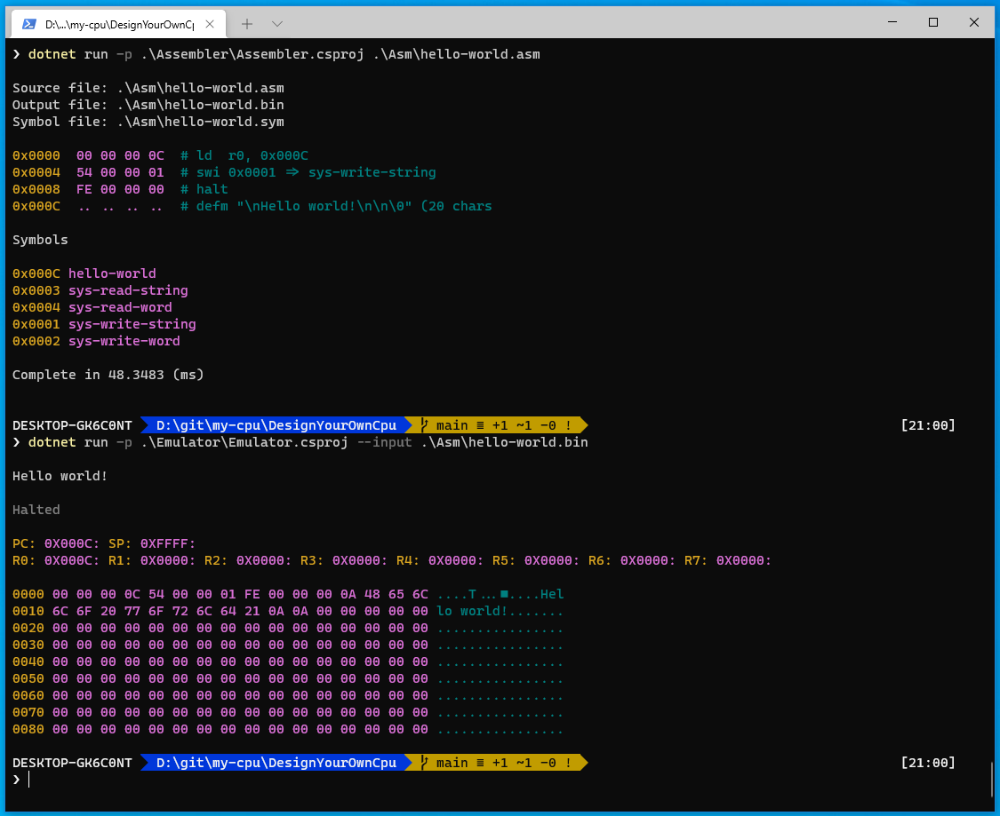

# Simple assembler and emulator

A implementation of the assembler and emulator for the simple processor design presented in the
[Gary explains videos][1] on YouTube.

Specific videos:
 - [Design your own instruction format][3]
 - [Write Your Own Assembler for Your Own CPU][4]
 - [As yet un released video][5]

Gary's [original source][2] is available on Github

## Assembly language

Assembly language is written one instruction per line. Lines starting with the comment character `#` are ignored. Any lines with trailing comments 

    LD R1, 65535 # set all bits to 1

will have the training comment removed before parsing.

Instructions are parsed in a case insensitive manner. The following two lines are the same

    LD R1, 0xFE03
    ld r1, 0xfe03

Numeric constants can be decimal, hexadecimal, or octal.

| Base | Example | Description |
| --- | --- | --- |
| 16 | 0x3421 | Prefixed with 0x and containing the digits `0 -f` (case insensitive)
| 10 | 32768 | Decimal numbers have no prefix, first digit cannot be 0, digits are `0 - 9`
| 8 | 03422 | Octal numbers are prefixed with a 0, digits are `0 - 7`

## Registers

There are eight general purpose registers `r0` ... `r7`, available to user code. Register `r8` is the program counter
and `r9` the stack pointer, neither of which can be accessed by user code. So there.

## Instruction set

Instruction definitions. All instructions are 32 bits long, unused bytes set to 0. Registers are 16 bit.

### Load and store instructions
|   Instruction   | Opcode | Register | Data H | Data L | Description |
|-----------------|--------|----------|--------|--------|-------------|
| `LD R1, 0xDEBA`    | `0x00`   | `0..7` | `0xDE` | `0xBA` | Load register with constant value         |
| `LD R1, R2`        | `0x01`   | `0..7` | `0x00` | `0..7` | Load register from another register       |
| `LD R1, (0xBEAD)`  | `0x02`   | `0..7` | `0xBE` | `0xAD` | 2 Load register direct from a memory address |
| `ST  R1, (0xDEBA)` | `0x10`   | `0..7` | `0xDE` | `0xBA` | 2store register direct to address      |
| `STL R1, (0xDEBA)` | `0x11`   | `0..7` | `0xDE` | `0xBA` | 2store low byte of register direct to address     |
| `STH R1, (0xDEBA)` | `0x12`   | `0..7` | `0xDE` | `0xBA` | 2store high byte of register direct to address   |
| `ST  R1, (R2)`     | `0x13`   | `0..7` | `0x00` | `0..7` | 2store register to indirect address held in second register |
| `STL R1, (R2)`     | `0x14`   | `0..7` | `0x00` | `0..7` | 2store low byte of register to indirect address held in second register |
| `STH R1, (R2)`     | `0x15`   | `0..7` | `0x00` | `0..7` | s2tore high byte of register to indirect address held in second register       |

### Compare and branch instructions
|   Instruction   | Opcode | Register | Data H | Data L | Description |
|-----------------|--------|----------|--------|--------|-------------|
| `CMP R1, R2`       | `0x20`   | `0..7` | `0x00` | `0..7` | Compare R1 with R2       |
| `CMP R1, 0xDEBA`   | `0x21`   | `0..7` | `0xDE` | `0xBA` | compare register with constant value         |
| `BEQ 0xDEBA`   | `0x30`   | `0x00` | `0xDE` | `0xBA` | Branch if last comp was equal, to address (or label)   |
| `BGT .LOOP`   | `0x31`   | `0x00` | `0xDE` | `0xBA` | Branch if last comp was greater than, to address (or label)   |
| `BLT 0xDEBA`   | `0x32`   | `0x00` | `0xDE` | `0xBA` | Branch if last comp was less than, to address (or label)   |
| `BRA LABEL`   | `0x33`   | `0x00` | `0xDE` | `0xBA` | Branch always to address (or label)   |

### Arithmetic
|   Instruction   | Opcode | Register | Data H | Data L | Description |
|-----------------|--------|----------|--------|--------|-------------|
| `ADD R1, 0xabcd` | `0x40` | `0..7` | `0xAB` | `0xCD` | add constant value to register|
| `SUB R1, 0xabcd` | `0x41` | `0..7` | `0xAB` | `0xCD` | subtract constant value from register|
| `ADD R1, R2`     | `0x42` | `0..7` | `0x00` |  `0..7` | add register 2 to register 1 (result in r1) |
| `SUB R1, R2`     | `0x43` | `0..7` | `0x00` |  `0..7` | subtract register 2 from register 1 (result in r1)|
| `MUL R1, 0xabcd` | `0x44` | `0..7` | `0xAB` | `0xCD` |1 multiply constant value with register|
| `DIV R1, 0xabcd` | `0x45` | `0..7` | `0xAB` | `0xCD` | 1 divide register by constant value|
| `MUL R1, R2`     | `0x46` | `0..7` | `0x00` |  `0..7` | 1 multiply register 1  with register 2 (result in r1) |
| `DIV R1, R2`     | `0x47` | `0..7` | `0x00` |  `0..7` | 1 divide register 1 by register 2 (result in r1)|

### Stack-oriented instructions
|   Instruction   | Opcode | Register | Data H | Data L | Description |
|-----------------|--------|----------|--------|--------|-------------|
| `PUSH R2` | `0x50` | `0..7` | `0x00` | `0x00` | 1 Push register onto the stack|
| `POP R2` | `0x51` | `0..7` | `0x00` | `0x00` | 1 pop register from the stack|
| `CALL 0x3498` | `0x52` | `0x00` | `0x34` | `0x98` | 1 calls a subroutine, storing the return address on the stack|
| `RET` | `0x53` | `0x00` | `0x00` | `0x00` | 1 pop the return address of a subroutine from the stack and jump there|
| `SWI 0x0003` | `0x54` | `0x00` | `0x00` | `0x03` | 1 invokes a software interrupt (see section below) execution continues with the next instruction after this when the interrupt exits.|

### Miscellaneous instructions
|   Instruction   | Opcode | Register | Data H | Data L | Description |
|-----------------|--------|----------|--------|--------|-------------|
| `HALT`             | `0xFE`   | `0x00` | `0x00` | `0x00` | Stops the processor from executing        |
| `NOOP`             | `0xFF`   | `0x00` | `0x00` | `0xoo` | Does nothing, with no side effects        |

### Assembler pseudo-instructions
|   Instruction   | Description |
|-----------------|-----------------------------------------------------------------------------------|
| `.label`        | Defines a label that holds the current address. placed on a line by itself        |
| `defs 0x20`     | 1reserves 0x20 bytes of storage at the current address                             |
| `defm "hello world\n\0"` | 1Defines a message. This is a MASCII string that can contain any valid MASCII characters, plus \0 (0 byte terminator) \n (start new line) \t (tab) |

## Software interrupts

Software interrupts allow the program to invoke methods in the pseudo-kernel or ROM (What ever takes your fancy). These software interrupts allow the user to read and write strings and integers etc. the following software interrupts are defined, and the associated symbols are pre-defined in the assembler symbol table.

| Interrupt name | interrupt number | DEscription |
| --- | --- | --- |
| `sys-write-string` | 1Write the MASCII string whose address is contained in `R0` to the console |
| `sys-write-word` | 1Write the 32 bit word whose value is contained in `R0` to the console |
| `sys-read-string` | 1Read a string from the console and store it at the address in `R0` with a max length stored in `R1`. The max length includes a zero terminator that is always added | 
| `sys-read-word` | 1read an integer value from the console and return it in `R0` | 

### Example: `sys-write-string`
  
        ld r0, hello-world      # load r0 with the address of the string
        swi sys-write-string    # invoke the software interrupt
        halt                    # hal the processor we are done

    .hello-world    
        defm "\nHello world!\n\n\0"

this will produce the following output

    Hello world!

    Halted

## Instructions for use (Windows or Linux)

+ Make sure you have the DotNet Core 5 SDK installed.
+ Clone the git repository

cd into the folder `repo\DesignYourOwnCpu` (where repo is the folder you cloned the source into)

To assemble the `hello-world.asm` file on windows:

    dotnet run -p .\Assembler\Assembler.csproj --input .\Asm\hello-world.asm

and on Linux, use:

    dotnet run -p ./Assembler/Assembler.csproj --input ./Asm/hello-world.asm

Output

    Source file: .\Asm\hello-world.asm
    Output file: .\Asm\hello-world.bin
    Symbol file: .\Asm\hello-world.sym

    0x0000  00 00 00 0C  # ld  r0, 0x000C
    0x0004  54 00 00 01  # swi 0x0001 => sys-write-string
    0x0008  FE 00 00 00  # halt
    0x000C  .. .. .. ..  # defm "\nHello world!\n\n\0" (20 chars

    Symbols

    0x000C hello-world
    0x0003 sys-read-string
    0x0004 sys-read-word
    0x0001 sys-write-string
    0x0002 sys-write-word

The assembler will assemble the code in `hello-world.asm` and will produce two files: `hello-world.bin` and `hello-world.sym`. The assembler also shows the opcodes associated with the assembly code and a dump of the symbol table including built in symbols like `sys-write-string`.

To execute the assembled code use the emulator via dotnet run. In windows use

    dotnet run -p .\Emulator\Emulator.csproj --input .\Asm\hello-world.bin

and on Linux, it's

    dotnet run -p ./Emulator/Emulator.csproj --input ./Asm/hello-world.bin

This produces the following output

    Hello world!

    Halted

    PC: 0X000C: SP: 0XFFFF:
    R0: 0X000C: R1: 0X0000: R2: 0X0000: R3: 0X0000: R4: 0X0000: R5: 0X0000: R6: 0X0000: R7: 0X0000:

    0000 00 00 00 0C 54 00 00 01 FE 00 00 00 0A 48 65 6C ....T...■....Hel
    0010 6C 6F 20 77 6F 72 6C 64 21 0A 0A 00 00 00 00 00 lo world!.......
    0020 00 00 00 00 00 00 00 00 00 00 00 00 00 00 00 00 ................
    0030 00 00 00 00 00 00 00 00 00 00 00 00 00 00 00 00 ................
    0040 00 00 00 00 00 00 00 00 00 00 00 00 00 00 00 00 ................

The output consists of the text output from the emulation and then a dump of the final state of the registers and low memory addresses.

### Example apps

The following example applications available

| Name | Description |
|--|--|
| [hello-world.asm][6] | The most basic and necessary program in existence. Prints `Hello World!` to the console. |
| [sum-two-ints-register-based.asm][7] | Prompts the user to enter two numbers and writes the sum of the two numbers to the console.  |

## Gratuitous screenshots

Here is the assembler and emulator running on windows 

and here they are gamboling on Linux

---

1 A new instruction not in the original Gary explains Instruction Set Architecture

2 Altered instruction syntax for addressing which replaces the `$constant` format with the form `(constant)`, which is closer to real world syntax used in assemblers. The original syntax of `$constant` made the parser easier to implement. At the cost of a more complex assembler implementation, the bracketed format is easier to understand, particularly for those of use who are dyslexic.

[1]: https://www.youtube.com/c/GaryExplains
[2]: https://github.com/garyexplains/examples
[3]: https://www.youtube.com/watch?v=wjHlvQfo5uI&list=PLxLxbi4e2mYGvzNw2RzIsM_rxnNC8m2Kz&index=4
[4]: https://www.youtube.com/watch?v=5ImTvOyvH2w&list=PLxLxbi4e2mYGvzNw2RzIsM_rxnNC8m2Kz&index=1

[5]: https://www.google.com
[6]: https://github.com/davidblackuk/design-your-own-cpu/blob/main/DesignYourOwnCpu/Asm/hello-world.asm
[7]: https://github.com/davidblackuk/design-your-own-cpu/blob/main/DesignYourOwnCpu/Asm/sum-two-ints-register-based.asm
[8]: https://github.com/davidblackuk/design-your-own-cpu/blob/main/images/linux.png
[9]: https://github.com/davidblackuk/design-your-own-cpu/blob/main/images/windows.png

